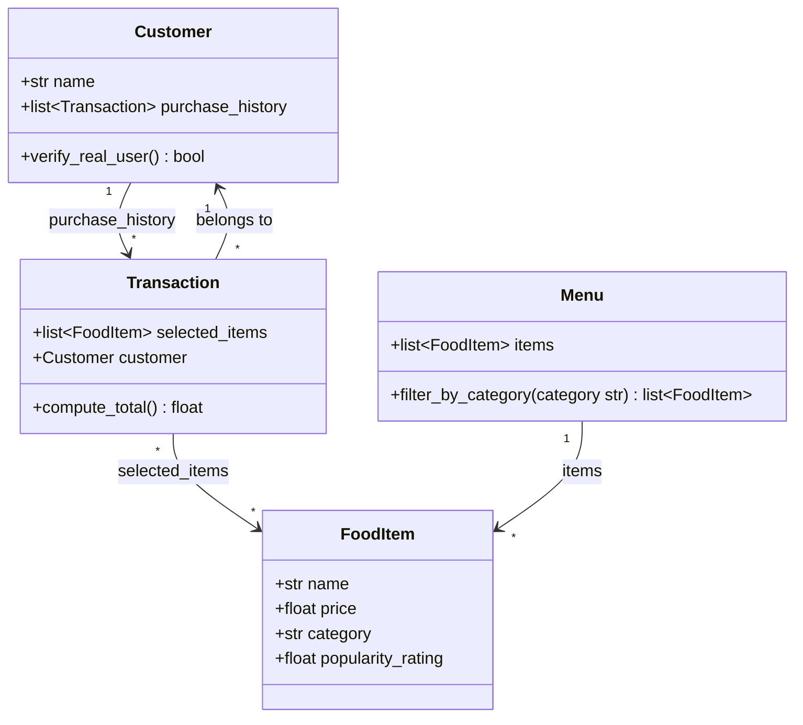

## Candidate Classes

1. **Customer**: Tracks customer information, including name and past purchase history, to verify they are real users.
2. **FoodItem**: Models individual food items, tracking details like name, price, category, and popularity rating.
3. **Menu**: A collection/list of food items that allows filtering by category (e.g., Drinks or Desserts).
4. **Transaction**: Groups selected food items together, associates them with a customer, and computes the total cost.

## Class Diagram

